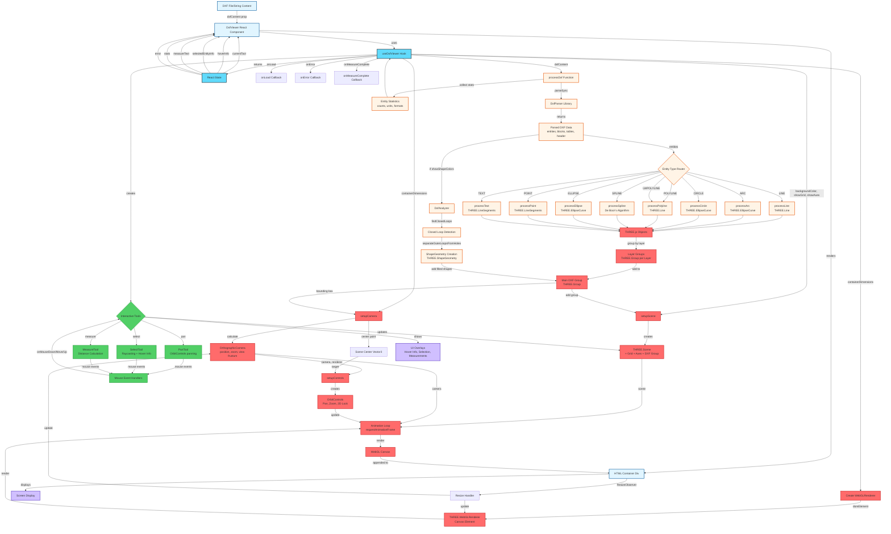

# DXF Viewer Architecture Flow

## Detailed Flow Description

### 1. **Input & React Component**

- User provides DXF file content as string via `dxfContent` prop
- `DxfViewer` component wraps the viewer logic
- Component creates a container div for the canvas

### 2. **DXF Parsing**

- `processDxf` function receives DXF string
- Uses `DxfParser` library to parse DXF format
- Extracts entities, blocks, layer tables, and header information
- Handles parse errors gracefully

### 3. **Entity Processing**

- Each entity type is routed to appropriate processor:

  - **Lines**: Direct vertex mapping to `THREE.Line`
  - **Arcs/Circles**: Converted using `THREE.EllipseCurve`
  - **Polylines**: Vertex array to `THREE.Line`
  - **Splines**: De Boor's algorithm evaluation for B-spline curves
  - **Ellipses**: Ellipse curve with rotation
  - **Points**: Rendered as small crosses
  - **Text**: Rendered as bounding boxes

### 4. **Layer Organization**

- Entities grouped by layer into `THREE.Group` objects
- Layer colors applied based on DXF layer table
- All layer groups added to main DXF group

### 5. **Shape Analysis (Optional)**

- `DxfAnalyzer` finds closed loops using connectivity analysis
- Separates outer loops from holes using containment testing
- Creates `THREE.ShapeGeometry` for filled shapes
- Only runs when `showShapeColors` is enabled (performance optimization)

### 6. **Scene Setup**

- **Camera**: `setupCamera` creates orthographic camera positioned above scene

  - Calculates bounding box of DXF content
  - Sets view frustum based on content size and container aspect ratio
  - Positions camera to look straight down (2D view)
  
- **Scene**: `setupScene` creates THREE.Scene with:

  - Background color
  - Optional grid (major/minor divisions)
  - Optional axes helper
  - DXF content group
  
- **Renderer**: Creates `THREE.WebGLRenderer` with:

  - Antialiasing enabled
  - High-performance power preference
  - Pixel ratio optimization
  - Canvas sized to container

- **Controls**: `setupControls` configures `OrbitControls` for:

  - Pan (mouse drag)
  - Zoom (mouse wheel)
  - Rotation disabled (2D lock)
  - Touch support

### 7. **Rendering Loop**

- Animation loop using `requestAnimationFrame`
- Each frame:

  1. Updates controls (pan/zoom)
  2. Locks camera to 2D view (looking straight down)
  3. Renders scene to canvas
- Canvas element appended to container div

### 8. **Interactive Tools**

- **Pan Tool**: Uses OrbitControls panning
- **Select Tool**: Raycasting to detect entity intersections

  - Shows hover info overlay
  - Displays selected entity details
- **Measure Tool**: Calculates distances between points

  - Shows measurement text overlay
  - Triggers `onMeasureComplete` callback

### 9. **State Management**

- React hooks manage:

  - Current active tool
  - Hover information
  - Selected entity details
  - Measurement text
  - File statistics
  - Error states
- State updates trigger UI re-renders

### 10. **Event Handling**

- Mouse events (down, move, up) routed to active tool
- Tools interact with scene via raycasting
- UI overlays updated based on tool interactions

### 11. **Resize Handling**

- `ResizeObserver` monitors container size changes
- Updates camera view frustum to maintain aspect ratio
- Resizes renderer canvas to match container

### 12. **Output**

- WebGL canvas rendered in browser
- UI overlays for tools, measurements, debug info
- Displayed in user's browser window

## Key Design Decisions

1. **Orthographic Camera**: Ensures true 2D CAD view without perspective distortion
2. **Layer-based Organization**: Maintains DXF layer structure in Three.js groups
3. **Optional Shape Analysis**: Only processes closed loops when needed for performance
4. **Tool System**: Extensible architecture for adding new interactive tools
5. **SSR Compatibility**: Guards prevent server-side rendering issues
6. **Error Handling**: Graceful degradation when parsing fails
